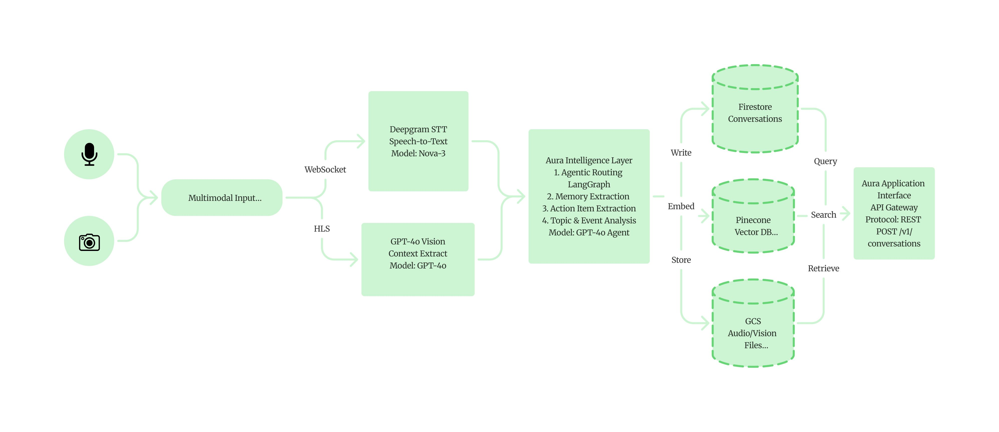
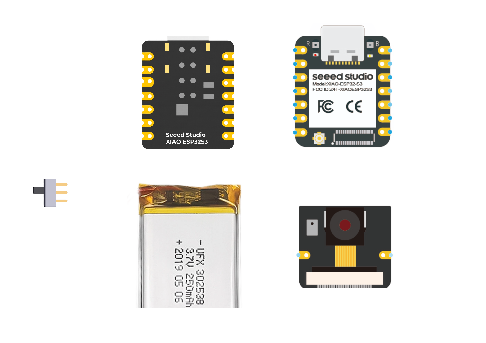
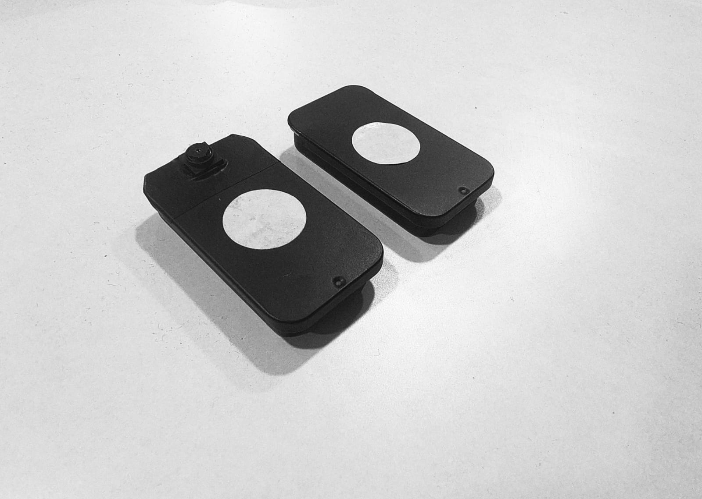
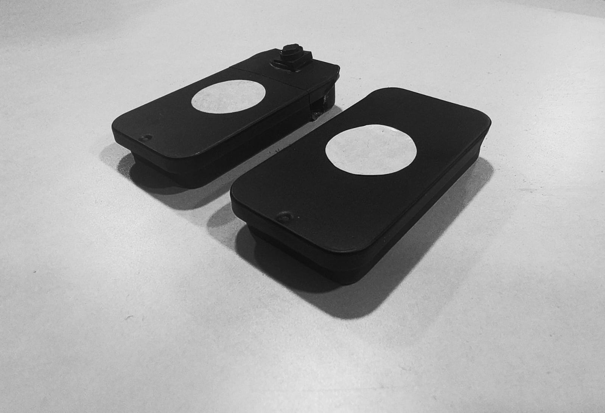

<div align="center">


<br/>

# AURA

**Open-source AI wearable pendant. Sees it. Hears it. Remembers it.**

<br/>

[](LICENSE)
[](https://wiki.seeedstudio.com/xiao_esp32s3_getting_started/)
[](app/android)
[](#bill-of-materials)
[](https://github.com/thesohamdatta/Aura-Wearable-AI/stargazers)

</div>

<br/>

---

<br/>

<div align="center">

AURA is a pendant you wear around your neck. It continuously captures audio and images, streams them to your phone, and AI turns everything into searchable memories, summaries, and action items — automatically.

**What it is:** A wearable AI context engine · Open hardware + firmware + app · ~10 hours battery · Under 50g

**Built for:** developers, researchers, and builders who want to extend it.

</div>

<br/>

---

<br/>

## Table of Contents

- [How it works](#how-it-works)
- [Mobile App](#mobile-app)
- [Bill of Materials](#bill-of-materials)
- [Hardware](#hardware)
  - [Specs](#xiao-esp32-s3-sense-specs)
  - [Battery System](#battery-system)
- [3D Enclosure](#3d-enclosure)
- [Build Guide](#build-guide)
  - [1 — Firmware](#1--firmware)
  - [2 — Mobile App Setup](#2--mobile-app-setup)
  - [3 — Backend](#3--backend)
  - [4 — Local / Private Mode](#4--local--private-mode)
- [AI Provider Reference](#ai-provider-reference)
- [Build Checklist](#build-checklist)
- [Troubleshooting](#troubleshooting)
- [Project Structure](#project-structure)
- [Contributing](#contributing)
- [License](#license)

<br/>

---

<br/>

## How it works

<div align="center">



</div>

<br/>

```
        Microphone + Camera
               │
         ESP32-S3 Sense          ←  captures audio & images
               │
           BLE / WiFi
               │
           Phone App              ←  pairs, streams, displays
               │
           Backend API
       ┌───────┴───────────────────────┐
       │   Deepgram  →  transcript     │
       │   GPT-4o    →  vision         │  ←  all processed here
       │   Pinecone  →  memory         │
       └───────────────────────────────┘
               │
   Memories · Summaries · Actions      ←  what you get
```

<br/>

---

<br/>

## Mobile App

<div align="center">


<br/><sub>Conversations · Memories · Tasks · Search</sub>

</div>

<br/>

---

<br/>

## Bill of Materials

**Total: ~$60 USD**

<div align="center">

</div>

<br/>

| Component | Spec | Qty | Cost | Link |
|:---|:---|:---:|:---:|:---|
| XIAO ESP32-S3 Sense | MCU + Camera + Mic | 1 | ~$15 | [Seeed Studio](https://www.seeedstudio.com/Seeed-XIAO-ESP32S3-Sense-p-5639.html) |
| LiPo Battery 250mAh | 3.7V flat type | 2 | ~$8 | [Amazon](https://www.amazon.com) |
| Slider Switch | SS12D00-G3, 3mm | 1 | ~$1 | [Amazon](https://www.amazon.com/dp/B099MRCDG8) |
| Wire | 28 AWG silicone | 1 set | ~$5 | [Amazon](https://www.amazon.com/dp/B09X4629C1) |
| 3D Printed Case | PLA/PETG, STL included | 1 | ~$3 | [Print or order](#3d-enclosure) |
| Necklace cord | 2–3mm, any length | 1 | ~$2 | Craft store |

> Order 2 extra batteries. LiPo capacity varies by batch.

<br/>

---

<br/>

## Hardware

<div align="center">

<table>
<tr>
<td align="center" width="50%">

<br/><sub>AURA — Front face</sub>
</td>
<td align="center" width="50%">

<br/><sub>AURA — Worn as a pendant</sub>
</td>
</tr>
<tr>
<td align="center" width="50%">

<br/><sub>AURA — Device views</sub>
</td>
<td align="center" width="50%">

<br/><sub>AURA — Back and side profiles</sub>
</td>
</tr>
</table>

</div>

<br/>

### XIAO ESP32-S3 Sense Specs

| | |
|:---|:---|
| CPU | Dual-core Xtensa LX7 @ 240MHz |
| RAM | 8MB PSRAM (OPI — required for camera) |
| Camera | OV2640 up to 1600×1200 |
| Mic | Built-in PDM |
| Wireless | WiFi 802.11 b/g/n + BLE 5.0 |
| Power | USB-C charging + battery |

<br/>

### Battery System

2× 250mAh in parallel = **500mAh total**

```
Active draw (Camera + BLE + processing)  ~80mA
Standby (BLE connected, camera off)      ~40mA
Deep sleep                                ~2mA

500mAh ÷ ~80mA average  ≈  8–10 hours
```

SS12D00-G3 slider switch inline with battery ground wire.

<br/>

---

<br/>

## 3D Enclosure

<div align="center">

<table>
<tr>
<td align="center" width="50%">

<br/><sub>Exploded — component fit &amp; assembly order</sub>
</td>
<td align="center" width="50%">

<br/><sub>Top view — full assembly layout</sub>
</td>
</tr>
</table>

<br/>

<table>
<tr>
<td align="center" width="33%">

<br/><sub>ESP32-S3 Base Board</sub>
</td>
<td align="center" width="33%">

<br/><sub>Expansion Board</sub>
</td>
<td align="center" width="33%">

<br/><sub>Camera Module</sub>
</td>
</tr>
</table>

</div>

<br/>

**Print settings:**

| Setting | Value |
|:---|:---|
| File | `hardware/CASE.stl` |
| Material | PLA or PETG |
| Layer height | 0.15–0.20mm |
| Infill | 20% |
| Supports | Yes |

No printer? Upload to [JLCPCB](https://3d.jlcpcb.com) or [Craftcloud](https://craftcloud3d.com).

<br/>

---

<br/>

## Build Guide

Follow in order. Don't skip steps.

<br/>

### 1 — Firmware

See full details in [`firmware/readme.md`](firmware/readme.md).

**Requirements:**
- [Arduino IDE 2.x](https://www.arduino.cc/en/software) or [PlatformIO](https://platformio.org/install)
- ESP32 board package — add this URL in `File → Preferences`:

```
https://raw.githubusercontent.com/espressif/arduino-esp32/gh-pages/package_esp32_index.json
```

Then `Tools → Board → Boards Manager` → search `esp32` → Install.

**Board settings — get these right before uploading:**

```
Tools → Board  →  XIAO_ESP32S3
Tools → PSRAM  →  OPI PSRAM        ← required. Camera fails without this.
Tools → Port   →  your COM port
```

> **Windows only:** If COM port doesn't appear, install the [CH340 driver](https://www.wch-ic.com/downloads/CH341SER_EXE.html) and restart.

**Get the code:**

```bash
git clone https://github.com/thesohamdatta/Aura-Wearable-AI.git
cd Aura-Wearable-AI/firmware
```

**Key config values in `firmware/src/config.h`:**

```cpp
#define BLE_DEVICE_NAME            "AURA"
#define PHOTO_CAPTURE_INTERVAL_MS  30000   // image every 30s
#define MIC_SAMPLE_RATE            16000   // 16kHz audio
#define CAMERA_FRAME_SIZE          FRAMESIZE_VGA
```

**Upload via UF2 (easiest):**

```
1. Hold BOOT → press RESET → release BOOT
2. Device appears as USB drive "ESP32S3"
3. Copy firmware/releases/aura_glass_firmware.uf2 to the drive
4. Device reboots automatically
5. Open Serial Monitor @ 115200 baud
```

**Upload via Arduino IDE:**

```
1. Connect ESP32-S3 via USB-C
2. Hold BOOT → press RESET → release BOOT
3. Click Upload in Arduino IDE
4. Open Serial Monitor @ 115200 baud
```

Expected output:

```
[AURA] Camera initialized
[AURA] Microphone initialized
[AURA] BLE advertising
[AURA] Ready
```

<br/>

### 2 — Mobile App Setup

**Build from source (Android):**

```bash
cd Aura-Wearable-AI/app/android

# Open in Android Studio, or build via Gradle:
./gradlew assembleDebug

# Install on connected device:
./gradlew installDebug
```

Open app → pair via Bluetooth → done.

<br/>

### 3 — Backend

See full details in [`backend/README.md`](backend/README.md).

**API keys you need:**

| Service | Free tier? | Get key |
|:---|:---:|:---|
| Firebase | Yes | [console.firebase.google.com](https://console.firebase.google.com) |
| Deepgram | Yes | [console.deepgram.com](https://console.deepgram.com) |
| OpenAI | No | [platform.openai.com](https://platform.openai.com) |
| Pinecone | Yes | [app.pinecone.io](https://app.pinecone.io) |
| Redis (Upstash) | Yes | [console.upstash.com](https://console.upstash.com) |

**Setup:**

```bash
cd Aura-Wearable-AI/backend

# Windows
python -m venv venv
venv\Scripts\activate

pip install -r requirements.txt

copy .env.template .env
# fill in your keys

uvicorn main:app --reload --env-file .env --port 8000
```

**Expose to the internet (required for device connection):**

```bash
# Install ngrok → https://ngrok.com
ngrok http 8000
```

In app settings, set:

```
API_BASE_URL=https://your-ngrok-url.ngrok-free.app/
```

Include the trailing slash.

<br/>

### 4 — Local / Private Mode

Run everything on your machine. No cloud required.

```bash
# Install Ollama → https://ollama.com
ollama pull moondream:1.8b-v2-fp16
ollama pull llama3.2
ollama serve
```

In `.env`:

```
OLLAMA_URL=http://localhost:11434/api/chat
OLLAMA_MODEL=llama3.2
VISION_MODEL=moondream:1.8b-v2-fp16
```

<br/>

---

<br/>

## AI Provider Reference

| Provider | Speed | Quality | Cost | Best for |
|:---|:---:|:---:|:---:|:---|
| OpenAI GPT-4o | Medium | Best | Paid | Vision + accuracy |
| Ollama (local) | Slow | Good | Free | Privacy |
| Deepgram | Fast | Excellent | Pay-as-go | Transcription |

Recommended stack: **Deepgram + GPT-4o Vision**

<br/>

---

<br/>

## Build Checklist

```
HARDWARE
[ ] Components ordered
[ ] Case printed (hardware/CASE.stl)
[ ] Battery wired — polarity verified with multimeter
[ ] Switch inline with battery ground
[ ] Assembled in case

FIRMWARE
[ ] Arduino IDE or PlatformIO installed
[ ] Board: XIAO_ESP32S3
[ ] PSRAM: OPI PSRAM   ← most common failure point
[ ] config.h reviewed
[ ] Upload successful
[ ] Serial monitor shows "Ready"

APP
[ ] Android app installed
[ ] Bluetooth paired
[ ] Device visible in app

BACKEND
[ ] .env filled with all keys
[ ] Server running (uvicorn)
[ ] ngrok tunnel active
[ ] API_BASE_URL set in app (with trailing slash)

VERIFY
[ ] Speak → transcription appears in app
[ ] Wait 30s → image capture shows in app
[ ] End session → memory generated
```

<br/>

---

<br/>

## Troubleshooting

<details>
<summary><b>Camera init failed</b></summary>

```
Cause: PSRAM not set to OPI PSRAM

Fix: Tools → PSRAM → OPI PSRAM → re-upload

Also: reseat the camera ribbon cable fully
```
</details>

<details>
<summary><b>COM port not visible (Windows)</b></summary>

```
Fix:
1. Install CH340 driver — wch-ic.com/downloads/CH341SER_EXE.html
2. Restart PC
3. Device Manager → Ports → look for COM3 or higher

If still missing:
Hold BOOT → plug USB → release BOOT (force download mode)
```
</details>

<details>
<summary><b>WiFi won't connect (OTA mode)</b></summary>

```
Check:
- Router must be 2.4GHz (ESP32 doesn't support 5GHz)
- SSID and password are case-sensitive
- No special characters in SSID

WiFi is only used for OTA firmware updates, not normal operation.
Normal operation uses BLE only.
```
</details>

<details>
<summary><b>Battery life too short</b></summary>

```
Adjust PHOTO_CAPTURE_INTERVAL_MS in firmware/src/config.h:
  5000   = every 5s   →  ~4 hours
  30000  = every 30s  →  ~8 hours
  60000  = every 60s  →  ~11 hours

Also check battery voltage divider calibration:
  VOLTAGE_DIVIDER_RATIO = 6.086f (default, calibrated)
```
</details>

<details>
<summary><b>App can't reach backend</b></summary>

```
Check in order:
1. ngrok is running
2. uvicorn server is running
3. API_BASE_URL has trailing slash
4. Firebase is configured

Test: curl http://localhost:8000/health
```
</details>

<br/>

---

<br/>

## Project Structure

```
Aura-Wearable-AI/
├── firmware/                    ← AURA firmware (ESP32-S3)
│   ├── firmware.ino             ← entry point (Arduino)
│   ├── src/
│   │   ├── app.cpp              ← main application logic
│   │   ├── mic.cpp              ← microphone (PDM/I2S)
│   │   ├── opus_encoder.cpp     ← audio compression
│   │   ├── ota.cpp              ← OTA firmware updates
│   │   └── config.h             ← all settings here
│   ├── releases/                ← pre-built UF2 binary
│   └── readme.md
│
├── app/
│   └── android/                 ← Android companion app
│
├── backend/                     ← FastAPI backend
│   ├── routers/
│   │   ├── transcribe.py        ← audio streaming
│   │   ├── conversations.py     ← memory management
│   │   └── chat.py              ← AI chat
│   ├── main.py
│   ├── requirements.txt
│   ├── .env.template            ← copy → .env
│   └── README.md
│
├── hardware/
│   └── CASE.stl                 ← 3D printable case
│
├── Assest/
│   ├── MAIN/                    ← hero images, app mockups
│   ├── 3D PARTS/                ← STL renders, exploded views
│   │   └── INSIDE VIEW/         ← CASE.stl + assembly renders
│   └── CIRCUIT DIAGRAM/         ← component photos
│
└── docs/                        ← developer documentation
```

<br/>

---

<br/>

## Contributing

```bash
git checkout -b feature/your-feature
# make changes
git commit -m "feat: short description of what and why"
# open pull request
```

Good contributions:
- **Hardware:** new case designs, better battery layout
- **Firmware:** power optimization, new sensors, compression
- **App:** new views, integrations, offline support
- **AI:** better prompts, model support, edge inference
- **Docs:** corrections, clarity, translations

Include photos or video for hardware changes. Keep PRs focused.

[Open an issue](https://github.com/thesohamdatta/Aura-Wearable-AI/issues) · [Browse open PRs](https://github.com/thesohamdatta/Aura-Wearable-AI/pulls)

<br/>

---

<br/>

## License

MIT. Use it, modify it, build products with it. Keep the license file.

<br/>

---

<br/>

<div align="center">

**AURA** — open hardware, open firmware, open app.  
Built on the ESP32-S3 Sense. Designed to be extended.

<br/>

[⭐ Star this repo](https://github.com/thesohamdatta/Aura-Wearable-AI) · [GitHub Issues](https://github.com/thesohamdatta/Aura-Wearable-AI/issues) · [Pull Requests](https://github.com/thesohamdatta/Aura-Wearable-AI/pulls)

<br/>


</div>